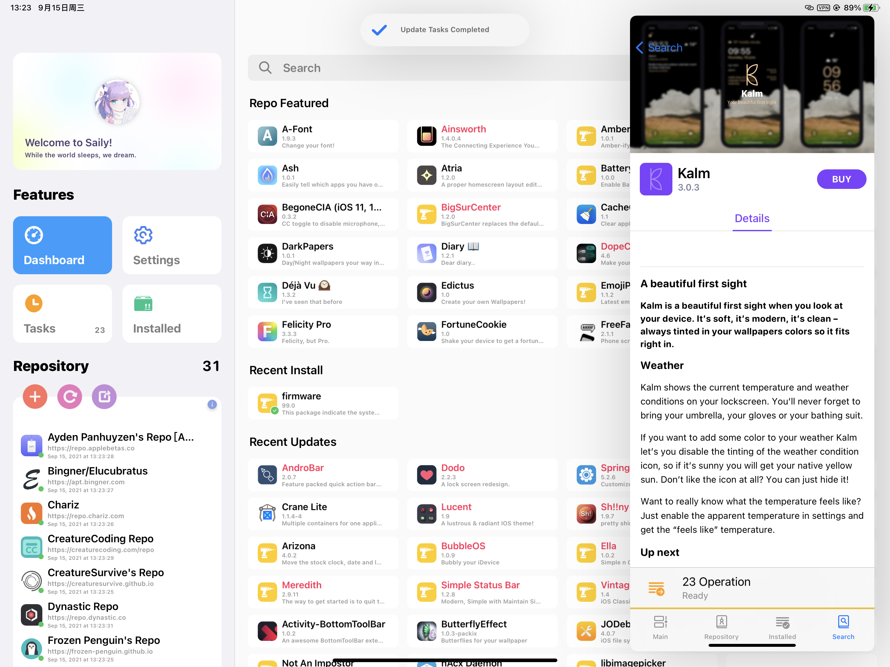

# Saily

## Modern. Fast. Beautiful.

Release Channel Repo: https://sailyteam.github.io/repo/

**You are in root branch, for rootless support, check out other branch.**

Description: Saily is a modern APT package manager for jailbroken devices running iOS/iPadOS 13 and up.

## Saily Features

- [ ] i18n help wanted [https://crwd.in/saily](https://crwd.in/saily)
- [x] Unique UI for **BOTH** iPhone and iPad
- [x] Import all your repos from Cydia, Sileo, Zebra, and Installer
- [x] Add and manage repositories without limitation
- [x] Built to work alongside all of your other package managers
- [x] Support for Web Depiction with dark mode
- [x] Support for Native Depictions with dark mode
- [x] Support for all jailbreaks (excluding rootlessJB)
- [x] Support for paid packages
- [x] Make everything clear with Version Control page listing all available versions and repos
- [x] Clean and stable packaging using CI machine
- [x] Random device info for free packages
- [x] Fully open-sourced under MIT Licence
- [x] Quick actions (eg respring, uicache) via Setting page

## Updates

In case you're looking for updates, we have an [official Twitter page](https://twitter.com/TrySaily) which is updated regularly with teasers of upcoming features and more. Do not try to contact this account as it is not meant to respond to any messages or replies. If you need support regarding Saily, refer to the "Support" Section of this article.

## Support

In case you need support regarding Saily or anything associated with it, contact [Saily Support](https://twitter.com/SailySupport) on Twitter or tag us in your tweet and we will do our best to help you with your issue.

## Bug Reports, Feature Requests, & Feedback

If you are experiencing any issues regarding Saily, and would like to file a bug report, make a feature request, or provide any other feedback to be reviewed by our team, please do so using the [Saily Bug Tracker](https://github.com/SailyTeam/Saily/issues). Do not contact individual people personally because that will not work. Please be sure to check if the issue you're experiencing has already been reported. Duplicated issues will be closed.

We are using [bugsnag](https://www.bugsnag.com/) for bug/crash tracking in application. [Privacy Licenses](https://docs.bugsnag.com/platforms/ios/appstore-privacy/) are additionally applied there, TL;DR, the diagnostic data is anonymous and will not be able to trace you back.

Additionally, if your issue is related to a crash or similar cases, there are some recommended info for you to include in the issue report.

- Your Bugsnag ID, in the Setting page or application log, will provide us a backtrace with code level diagnostic data. It does not contain any privacy related information.
- The application log, generally located at `/var/mobile/Documents/wiki.qaq.chromatic/Journal/`, will be helpful for tracking the issue. It is a plain text document and may include sensitive privacy related info (eg: searched text, repo urls ...), so check it before upload.

"Your next bug is not a bug, it's a feature." - Apple Inc.

## Contributing

If you want to contribute to the project, make a pull request with your changes and it will be reviewed by our team. Do not contact individual people personally in order to get your changes through because that will not work. With pull request, we may squash or rebase your changes to one commit.

## Compiling Project

For debugging with Xcode, there is nothing to setup for, just open the workspace and click run. Certifications and bundle identity are required to be changed in purpose of real device debugging. Debugging build will not include license info which is scanned and generated while compiling for release build.

For releasing/jailbroken compile, exeucte command line inside resources folder. Make sure to install dpkg, for building the package, and python3 for license scanning, xcpretty for a better output format. swiftlint and bartycrouch are optional.

## Credits

We would like to thank and akgnowledge everyone who has contibuted to this project. Your contibutions have brought us a long way and we wouldn't be here without you. Some of the contributors may not be listed in the git history, but still played a part in Saily's development. For a detailed license containing all for framework packages, open the app then you can find it in the app's setting page. This product includes software developed by the Sileo Team.

#### Project Leader: 
- [@Lakr233](https://twitter.com/Lakr233)

#### Marketing Director:
- [@BreckenLusk](https://twitter.com/BreckenLusk)

#### Code Level Contributors:
- [@Lakr233](https://twitter.com/Lakr233)
- [@Sou1ghost](https://twitter.com/Sou1gh0st)
- [@jkpang2](https://twitter.com/jkpang2)
- [@mx_yolande](https://twitter.com/mx_yolande)
- [@u0x01](https://twitter.com/u0x01)
- [@BreckenLusk](https://twitter.com/BreckenLusk)

#### Translators:
- [@BreckenLusk](https://twitter.com/BreckenLusk)
- [@Litteeen](https://twitter.com/Litteeen)
- [@fahlnbg](https://twitter.com/fahlnbg)
- [@lamtaodotstore](https://twitter.com/lamtaodotstore)
- [@Amachik](https://twitter.com/Amachik2)
- [@Minazuki_dev](https://twitter.com/Minazuki_dev)
- [@powen00hsiao](https://twitter.com/powen00hsiao)
- [@t0mi](https://twitter.com/t0mi292)

#### Official Twitter Accounts:
- [Main - @TrySaily](https://twitter.com/TrySaily)
- [Support - @SailySupport](https://twitter.com/SailySupport)  

#### "While the world sleeps, we dream."

---

Copyright © 2020 Saily Team. All Rights Reserved.
