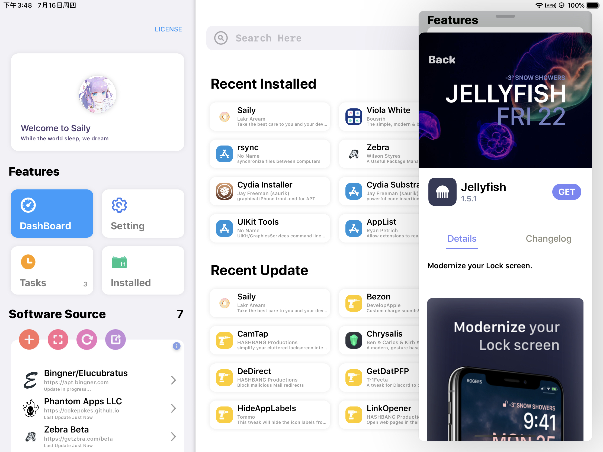

# Saily
### Modern. Fast. Beautiful.

Saily is an APT package manager for jailbroken devices running iPadOS 13 and up.

## Features

- [x] Import all your repos from Cydia, Sileo, Zebra, and Installer
- [x] Add and manage repositories without limitation
- [x] Smart update depends on the time gap between last refresh
- [x] Only refresh selected repo(s) and keep every record right
- [x] All package depictions, Native/Json Depiction, Web Depiction(with dark mode exists), Zebra Depiction
- [x] Paid packages/Payment management
- [x] Continue every package download breaking by anything
- [x] Multiple window support for iPadOS
- [x] Quick actions from Settings
- [x] No hidden network traffic nor obfuscation, full open sourced under MIT License
- [x] Random device info available from Settings for free packages
- [x] Tested to work with all your jailbreaks and lives with all your package managers together
- [x] Build and packaged by CI machine, clean and stable as it should be
- [ ] Unique iPhone UI design in progress... (ETA: end of October)
- [ ] Full support for rootlessJB (ETA: end of October)
- [ ] Full support for watchOS (ETA: Unavailable at this time)

## Credits

We make acknowledgement to everyone joined this party. They may not shown in the git history but will be listed here.

### Project Leader: 
- [@Lakr233](https://www.twitter.com/Lakr233)

### Code Level Contributor:
- [@Lakr233](https://www.twitter.com/Lakr233)
- [@Sou1ghost](https://twitter.com/Sou1gh0st)
- [@jkpang2](https://twitter.com/jkpang2)
- [@mx_yolande](https://twitter.com/mx_yolande)
- [@u0x01](https://twitter.com/u0x01)

### Translators:
- [@Litteeen](https://twitter.com/Litteeen)
- [@fahlnbg](https://twitter.com/fahlnbg)
- [@lamtaodotstore](https://twitter.com/lamtaodotstore)
- [@vondrck](https://twitter.com/vondrck)
- [@Minazuki_dev](https://twitter.com/Minazuki_dev)

### Official Social Account:
- [@TrySaily](https://twitter.com/TrySaily)

Ps. The account is hold by [@BreckenLusk](https://twitter.com/BreckenLusk)

## Boarding Instructions

- A mac running macOS 10.15 and above
- Xcode installed with Catalyst support
- Execute ./Attachments/boarding.sh
- Change bundle identify to unique one (dont forget watchOS app) (Or build it with bake.command inside Attachments folder)
- Check out coding instructions from [here](Attachments/Coding.md)

## Packaging

Our GitLab CI runner will package our stuff automatically. Contact master@233owo.com for more information. Besides, there is no porting plan for GitHub actions. The release will be made available on GitHub after CI passed all tests.

## Bug Report

If you are experience any issue, please file a report on issue page.

We need following information about an error:

- your device identify: iPhone/iPad X,X
- your network condition: WiFi, Mobile Network, Ethernet...
- the version of our app you installed
- the system version of your device
- the APT report if the bug is related with installation
- the /Library/dpkg folder if is related with installed section

There is bug all around the world. Be sure to check around if there is any duplicated otherwise we would close yours.

- Your next bug is not a bug, it is a feature. cc/ Apple

----
> While the world sleep, we dream.
----

Lakr Aream 2020.4.17 - MIT License
